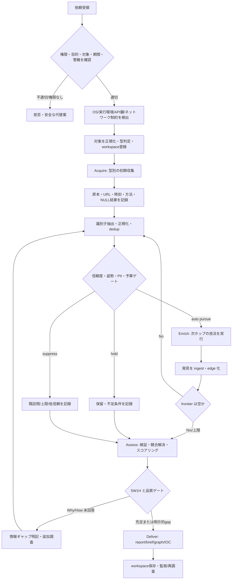
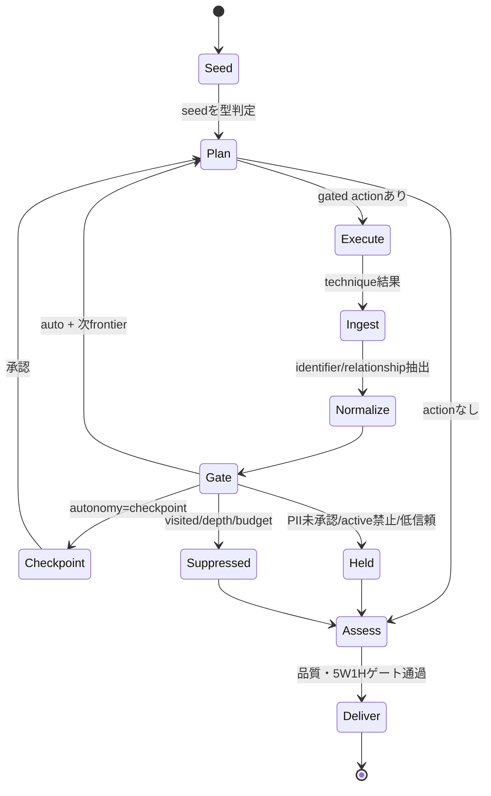
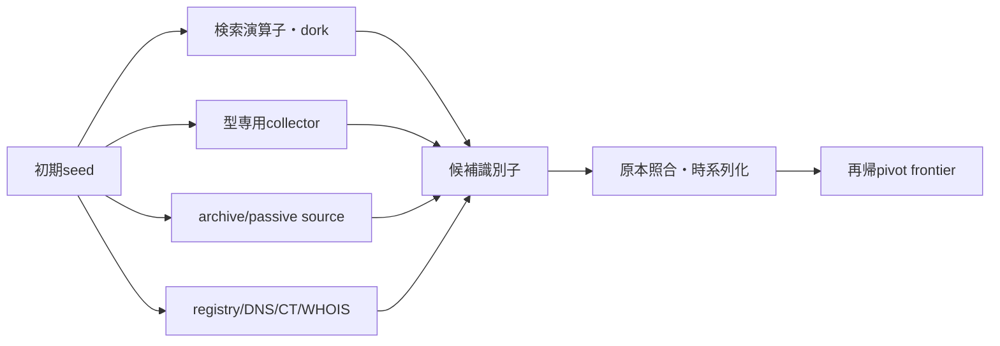
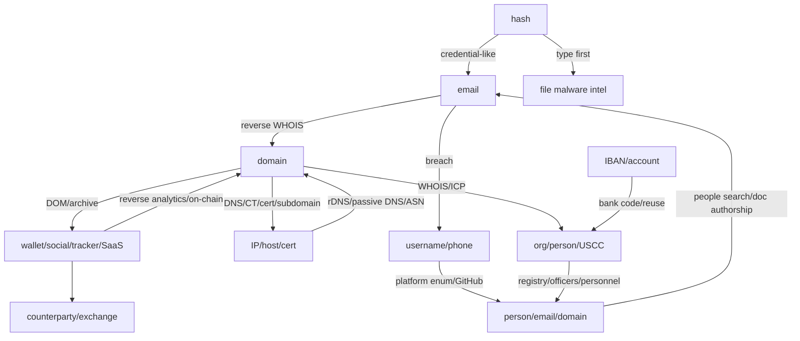
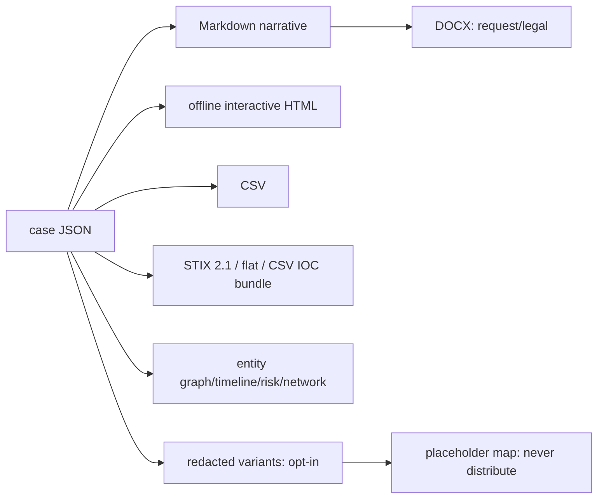

# 01 — エンドツーエンド調査・ピボットワークフロー

## 1. AEAD と再帰ピボットの全体像

Acquire と Enrich は一度ずつではない。収集結果から新しい識別子を作り、`pivot_orchestrator.py` が幅優先探索（BFS）のキュー、深度、重複、循環、予算を管理し、エージェントが各技法を実行して結果を再投入する。

## 2. 深度ごとの状態機械

### ゲート規則

| 判定 | 条件 | 動作 |
|---|---|---|
| CRITICAL | ≥95%、完全一致（同一 email、GA、cert、favicon、registrant、別 platform の同一 handle） | 自動追跡、件数上限なし |
| HIGH | ≥78%、強い相関 | 自動追跡、通常は型ごと最大 5（規則により 3） |
| MEDIUM | ≥63%、もっともらしい | balanced/exhaustive で追跡、最大 5 |
| LOW | <63% | 原則保留。独立した裏付け 2 件以上かつ exhaustive の場合のみ追跡 |
| suppress | 既訪問、循環、深度超過、総ノード超過 | 実行せず理由を ledger に記録 |
| PII hold | `authorization=unconfirmed` の person/phone | 手動レビューまで保留 |
| passive hold | passive 姿勢で直接接触が必要 | passive 情報源のみ実行 |

一致は帰属の証明ではない。テンプレート favicon やコピーされた tracker を考慮し、同一運営者の断定には原則として独立した再利用 artifact を 2 種以上重ねる。

## 3. Acquire の順序

1. 対象を canonical form にする（E.164、lowercase domain、URL 分解、IBAN の空白除去、ICP serial の枝番除去など）。
2. `/sweep` と `/query` で広く存在確認し、対象型の専用コマンドを同時に選ぶ。
3. hostile domain は live fetch 前に CT、passive DNS、urlscan、Wayback、検索結果を取得する。
4. Domain/URL は archive 全期間から email、phone、wallet、tracking ID、SaaS ID、social を harvest し first/last seen を付与する。
5. 発見した company/USCC、payment detail、hash はそれぞれ `/cn-corp`、`/iban`、`/hash-id` に即時ルーティングする。
6. 3 subjects 以上なら独立 enrichment を並列実行し、正規化後に merge/dedup する。

## 4. Enrich の関係グラフ

関係は `owns`、`uses`、`works_at`、`linked_to`、`alias`、`communicated_with` および case schema の `CONTROLS`、`REGISTERED`、`HOSTS`、`AUTHENTICATES` 等として、親ノード、発見方法、confidence とともに保存する。

## 5. Assess — 「見つけた」から「判断した」へ

1. **Finding 化**: PRIMARY（公式・一次）、DERIVED（独立 2 ソース以上）、CONFIRMED（信頼できる単一ソースを検証）、ANECDOTAL、CONTESTED を分離する。
2. **source reliability**: A–F を finding の内容信頼度とは別に採点する。
3. **競合解決**: 同一属性の矛盾は消さず、両方を保持し、片方を採用、双方 tentative、または conflict finding とする。
4. **異常検知**: account creation gap、platform presence mismatch、metadata mismatch、地理的移動不可能性、行動 signature、時系列 drift を検査する。
5. **帰属判断**: ACH（競合仮説分析）で複数仮説を不整合により比較し、runner-up も記載する。
6. **表現**: 事実には evidence confidence、推論には 1–99% の likelihood 用語を付け、両者を混同しない。
7. **Exposure**: 0–25 minimal、26–50 moderate、51–75 elevated、76–100 critical とし、根拠 finding を参照する。
8. **Coverage**: 技法の実施率に加え Who/What/When/Where/Why/How を確認する。Why/How が未回答なら gap を明示しない限り Deliver-ready にしない。
9. **NULL result**: 成果なしも実施済み経路として記録し、見つからないことを不存在の証明にしない。

## 6. Deliver と再現性

既定納品は Markdown、自己完結 HTML、JSON、CSV、IOC bundle。DOCX は依頼時／legal、redaction は opt-in。各主張は resolvable finding に結び、対象、取得日時、収集手段、制約、未解決 gap、スコープ外事項を記す。終了後は workspace を保存し、`/watch`、`/drift`、snapshot diff で変化を追跡する。
