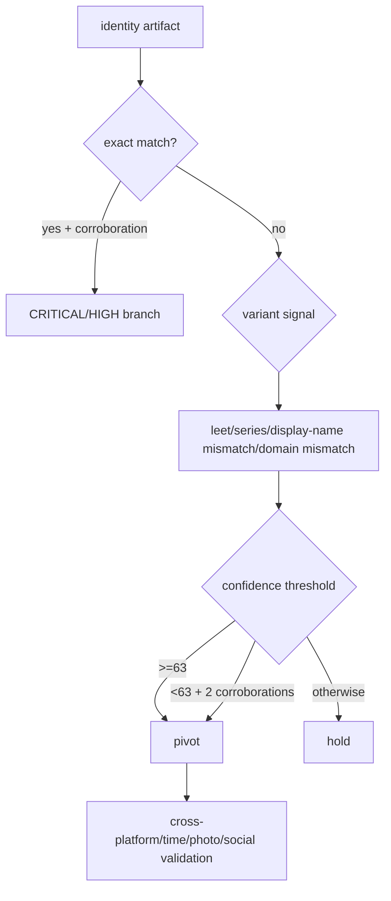
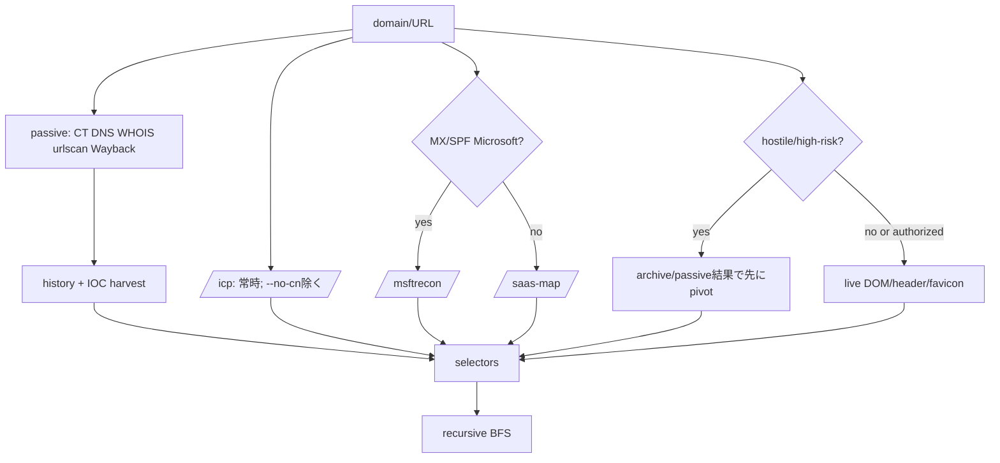

# 02 — データタイプ別の調査・ピボット・エンリッチ

以下は「その値が初期 seed の場合」と「途中で発見された場合」の両方に適用する。すべての新規値は正規化、重複排除、confidence gate を通し、親 finding と edge を保持する。

## A. 人・組織・デジタルアイデンティティ

| 入力型／前提 | 初動 | 主要エンリッチ | 次のピボット | 注意・停止条件 |
|---|---|---|---|---|
| **Person / alias**（正当な目的、同名識別子が必要） | 氏名・引用符・地域・所属を使う query、Telegram/docs dork、document author、公開 registry、professional/social profile | username 推定・列挙、email permutation、employment/education/license/court/regulatory、公知の associates、photo/metadata、timeline | handle、email、phone、org、domain、location、document | 同名異人を混ぜない。氏名単独は弱い。PII 未承認なら保留 |
| **Username / handle** | 3000+ platform enumeration、GitHub、Telegram/docs author dork、forum/paste | exact/leet/連番 variants、creation date、bio/link/profile image、followers/co-mentions/community、breach | profile、email、person、domain、別 handle、social graph | 同じ文字列だけで同一人と断定しない。画像・bio・時刻等で裏付け |
| **Email** | syntax/domain/MX、disposable/free/role 判定、account discovery、breach、PGP、Proton、dork | local-part reuse、reverse WHOIS、GitHub commit、header/SPF/DKIM/DMARC、provider/tenant、permutation | username、person、phone、domain、org、PGP key、breach event | breach データは被害者性を示すことが多い。credential hash を公開照会しない |
| **Phone**（E.164 化） | country/carrier/line type/VoIP、caller ID、spam/reputation、reverse public listing | messaging/social handle、地域整合性、公開 business listing、breach correlation | person、org、username、location | recycled number、spoofing、番号 portability に注意 |
| **Organization / brand** | legal/registry/news/query、primary domain、personnel、GitHub、dork/docleak、ransomware victim check | subsidiaries/parents/officers/UBO、domains、M365/SaaS、cloud/exposure、social topology、competitors | person、email、domain、tenant、USCC、ICP、repo、bank selector | ブランドと法人を分け、過去名称・管轄・子会社を時系列化 |
| **Social profile/share link** | canonical URL、sharelink resolver、platform-specific ID/date、public profile capture | handle reuse、outbound link、profile photo reverse search、post time/location、engagement topology | person、username、domain、image、location、associates | 非公開領域や access control を回避しない。bot/impersonation を検討 |

### アイデンティティ分岐条件

## B. Web・ネットワーク・インフラ

| 入力型／前提 | 初動 | 主要エンリッチ | 次のピボット | 注意・停止条件 |
|---|---|---|---|---|
| **Domain / URL** | WHOIS cascade、A/AAAA/MX/NS/TXT、CT/subdomain、traffic/tech/scam/threat、urlscan/Wayback、dork/docleak、ICP | DOM/header fingerprint、archive IOC harvest、historical DNS/cert/WHOIS、sensitive paths、email security、visitor/competitor、GitHub/secrets | IP、email、registrant、org、subdomain、cert、favicon、tracker、wallet、social、SaaS token | hostile は passive-first。live と archive を分離。CDN/shared hosting ノイズを抑制 |
| **IP (v4/v6)** | geo/ASN/ISP、rDNS、passive DNS、threat/noise、InternetDB ports/tags/vulns | co-hosted domains、services/banner、edge appliance→KEV/CVE、netblock、historical mapping、URLhaus/ThreatFox | domain、ASN、service、CVE、cert、related IP | NAT/CDN/VPN/Tor/shared host の帰属誤りに注意。能動 scan は許可時のみ |
| **Subdomain / hostname** | DNS/CT、HTTP status/title、admin/sensitive label、archive、cert | parent/sibling、IP、technology、login/API surface、filetype dork | domain、IP、cert、repo、endpoint | 発見＝脆弱性ではない。認証試行をしない |
| **ASN / netblock** | registry、owner、announced prefixes、member IP sampling | passive DNS、service/threat distribution、hosting relationships | IP、domain、org | 大手 cloud/CDN の ASN 共通性は低信頼 |
| **TLS cert / fingerprint** | CT timeline、issuer/SAN、hash typing | same certificate hosts via cert pivot、expired/reissued series | domain、IP、org | wildcard/shared managed cert を same-operator 証拠にしない |
| **Favicon mmh3/MD5/SHA-256** | hash を engine ごとに正しく検索 | Shodan/FOFA/ZoomEye/Censys/Netlas の matching hosts | domain、IP、kit cluster | template 製品の共通 favicon は誤陽性。別 artifact が必要 |
| **Analytics/ad ID** (GA4/GTM/UA/AdSense/Pixel) | DOM/Wayback/urlscan から抽出 | PublicWWW/DNSlytics/urlscan 等で reverse analytics | sibling domain、operator cluster | UA は historical。代理店や共通 container を排除 |
| **SaaS/operator token**（Sentry/Intercom/Crisp/Sheet/Make/Zapier 等） | source/DOM、archive から抽出 | source search、backend/tenant correlation | domain、org、workflow backend | secret と public identifier を区別し、秘密値を再利用しない |
| **M365 tenant / IdP** | MX/SPF が Microsoft なら msftrecon、DNS TXT/redirect/metadata | tenant ID、federation、MDI、SharePoint、Okta/Auth0/OneLogin/Ping/Keycloak/ADFS、unauth spec discovery | sibling domains、org、SaaS apps | 認証を試さず公開 metadata のみ。tenant presence ≠ compromise |
| **HTTP fingerprint / cookie / DOM hash / form** | headers、techstack、script/form/comment/skeleton を保存 | kit/template matching、CSP/third-party hosts、historical diff | related page、domain、software/CVE | 低～中 confidence。version banner は不正確な場合あり |
| **Sensitive path / API spec** | archive URL listを分類、公開 OpenAPI/GraphQL endpointを確認 | severity/timeline、repo reference、misconfiguration evidence | file/repo/secret/service | `.env` 等へ能動アクセスする前に許可確認。値を公開しない |

### Domain の条件分岐

## C. ファイル・画像・文書・位置・交通

| 入力型／前提 | 初動 | 主要エンリッチ | 次のピボット | 注意・停止条件 |
|---|---|---|---|---|
| **Image/photo/screenshot** | 原本 hash、EXIF、寸法／software、reverse image、ELA/clone/noise | face search（適法時）、crop/Lens、regional engine、landmark/sign/road side/weather/shadow、Street View/Maps/OSM | person、location、device、timestamp、source site | EXIF は編集可能、SNS で除去される。顔一致は候補であり本人確定でない |
| **Location/GPS/address** | format/precision/timezone、W3W/Plus Code/MGRS 変換、map確認 | Street View panorama、Overpass nearby POI、sign/brand/language、travel feasibility | image、event、person、org、SSID | 座標精度と取得日時を明記。私有地・自宅の不要な特定を避ける |
| **SSID/BSSID/MAC** | BSSID 正規化、WiGLE（鍵が必要な場合）、encryption/vendor | location history/travel pattern、nearby AP corroboration | device、location、person/org | SSID は非一意、AP 移設あり。BSSID の公開でプライバシー配慮 |
| **Document/PDF/Office/Google doc** | file hash、metadata/author/producer/timestamps、embedded link/image、gdoc owner、dork/docleak | revision/history、OCR、template/style、archive、author email/org、leak severity | person、email、org、domain、image、event | マクロを実行しない。タイムゾーン・metadata spoofing を検討 |
| **Generic file / disk image**（保全された証拠） | write blocker/chain of custody、cryptographic hash、image integrity | filesystem timeline、deleted file/carving、browser/system artifacts、IOC extraction | account、device、event、hash、domain/IP | ローカル forensic は OSINT ではなく許可証拠。原本を変更しない |
| **Aircraft** (tail/ICAO/flight) | registry、ADS-B/flight history、airport/time | owner/operator、route anomalies、photos/spotter records | org/person/location/event | blocked/limited feeds、callsign reuse、位置欠測を明記 |
| **Vessel** (IMO/MMSI/name) | registry/AIS、flag/owner、track/port calls | ownership history、dark gaps、co-location | org/location/event | AIS spoofing/off、同名船を IMO で識別 |
| **Vehicle** (VIN/plate) | VIN structure/check digit、authorized registry/theft/salvage | manufacturer/model/year、public listing/photo/location | person/org/event | plate lookup の法的制限、VIN cloning、個人住所を保護 |

## D. 金融・暗号資産・レジストリ・ハッシュ

| 入力型／前提 | 初動 | 主要エンリッチ | 次のピボット | 注意・停止条件 |
|---|---|---|---|---|
| **Crypto address/transaction** | chain/format、balance/lifetime flow、explorer、scam/ransomware reports | counterparties、exchange/service label、cluster、mixer/privacy pattern、time/value | wallet、exchange/org、domain、event | address ownershipは署名・取引所開示等なしに断定しない。chain-specific conventions |
| **IBAN** | uppercase/no-space、length、mod-97、country/BBAN/bank code | BIC/bank/jurisdiction、文字列再利用検索、invoice/page/log correlation | bank/org、domain、email、person | checksum valid は所有者証明でない。invalid は行動 finding。送金しない |
| **非IBAN口座/BIN/e-wallet** | 国・rail を特定、VietQR/NAPAS/card BIN 等を分解 | bank/issuer、account reuse、merchant/payment page correlation | org/person/domain | 法域差、口座名照会の規約、金融個人情報を保護 |
| **ICP licence** | province文字でなく serial を正規化、公式/ページ/archive照合 | serial reverse search、枝番 sibling site、registrant entity | domain、CN company、USCC | ICP は運営の強い手掛かりだが名義貸し・古い filing を検討 |
| **USCC / PRC company name** | checksum/表記、GSXT ground truth | TianYanCha/QCC/Aiqicha、信用中国、officers/shareholders/subsidiaries/UBO、ENSCan、CJK variants | person、org、domain、ICP | mainland access 不可は gap。簡体/繁体/pinyin の誤同定に注意 |
| **Hash-like string** | **必ず `/hash-id` が先**。長さ/charset/contextで候補列挙 | file hash→VT/MalwareBazaar/threat intel、cert hash→cert pivot、credential material→breach/private handling | malware family、file、domain/IP、cert、account | 32hexは MD5/NTLM、64hexは SHA-256/cert 等で曖昧。credential を公開 API に送らない |
| **CVE/product/version** | identifier validation、CIRCL/NVD、vendor advisory、CISA KEV | affected versions、exploit status、observed service mapping、remediation | appliance/IP/domain、incident | bannerだけで vulnerable と断定しない。認証済み scan の有無を明記 |

## E. セキュリティ証拠・監査対象（明示的許可が必須）

| 入力型 | 調査フロー | 得られるもの／次ピボット | 必須条件 |
|---|---|---|---|
| **Stealer-log folder** | family fingerprint→victim/operator triage→password/cookie/autofill/history/host info抽出→cross-log correlation | email/domain/URL/wallet/device/user/actor pattern、IOC | 合法取得・隔離環境・機微値の厳格管理。被害者を攻撃者と誤認しない |
| **Incident artifacts** | NIST 800-61 に沿い scope→preserve→triage→timeline→containment→IOC→lessons | hash/IP/domain/account/process/event、threat model | incident owner の許可、chain of custody、封じ込めと調査の影響調整 |
| **Cloud account/config** | provider/account/region scope→IAM→network→storage→compute→logging→secrets→IaC | risky principal/resource/policy、public exposure、remediation | 所有者許可、read-only role、変更操作なし、全 region/account の範囲明記 |
| **Source repository** | secrets→Git history/forks→dependency/SBOM→OWASP Top 10→CI/CD/IaC | exposed key、CVE、CWE、author/email/domain、supply-chain risk | 所有／公開 repo の範囲、secret を使用しない、誤陽性を手動確認 |
| **LLM/agent application** | dataflow/attack surface→prompt boundaries→output sinks→tool allowlist→permission/multi-tenant→defense layers | direct/indirect injection、confused deputy、data leak、unsafe tool call | テスト許可、production dataを避ける、破壊的 tool callを実行しない |
| **Darknet/leak/paste material** | Tor/アクセス安全性→source capture→hash/timestamp→claim extraction→cross-source verification | alias/contact/domain/wallet/breach event、monitoring lead | 違法コンテンツを取得・再配布しない。主張は低信頼から開始 |

## F. イベント・時系列・「値ではない」入力

- **Event/date range**: 記事、投稿、DNS/cert/WHOIS、archive、transaction、flight/AIS、incident timestamps を UTC と原 timezone の両方で統合し、first/last seen と before/after を比較する。
- **Device/service**: model/banner/MAC/cert/software を vendor advisory、CVE/KEV、IP/domain、cloud/tenant、location に接続する。
- **Claim/quote/news**: 原典、最古の出現、独立ソース、画像逆検索、archive diff、反証を集め、ジャーナリスト flow と ACH を適用する。
- **Unknown string**: context を保持したまま email/domain/IP/URL/phone/hash/wallet/IBAN/ICP/USCC/UUID/tracker ID を型推定する。曖昧なら複数解釈を並行キューに入れ、断定前に構文・checksum・周辺文脈で絞る。
